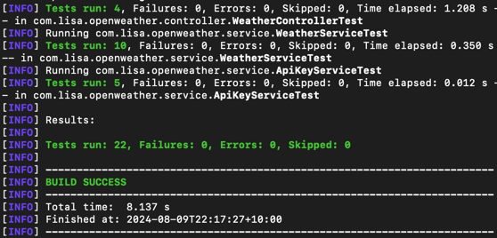

# Introduction to Design and Implementation

This Spring Boot application provides a REST API for fetching weather data from the OpenWeatherMap service. The application uses a traditional layered architecture suitable for backend services:

- **Controller Layer**:
    - `WeatherController.java`: Handles HTTP requests and responses for the getWeather API.

- **Service Layer**:
    - `WeatherService`: Contains the logic for processing weather data and managing interactions with external APIs.
    - `ApiKeyService`: Contains the logic for managing API keys.

- **Repository Layer**:
    - `WeatherRepository`: Interface that extends `JpaRepository` to perform CRUD operations with an H2 database. Handles data access and interactions with the database.

- **Model Layer**:
    - Represents the data and business objects including the `Weather` entity class and DTOs like `WeatherDataResponse` (maps the weather data response from OpenWeatherMap).

- **Key Components**:
  - RestTemplate: Used to make HTTP requests to the OpenWeatherMap API.

# Execution Instructions
## Prerequisites:
- Java Development Kit (JDK) 17 or later installed.
- Maven is required to build and manage the project.

## Setup:

1. **Clone the Repository**:
    ```bash
    git clone https://github.com/LisaCao0513/weather-service.git
    cd weather-service
    ```

2. **Configure API Keys**:
    - Open the `application.properties` file located in `src/main/resources`.
    - Set your OpenWeatherMap API key and other configuration properties as needed:
      ```properties
      openweather.api.key=your_api_key
      open.weather.url=service_base_url
      ```
    - For demo purposes, I have committed my key and base URL in the source code. For production use, do not commit sensitive information like that.

3. **Build and Run the Project**:
    ```bash
    mvn clean package
    java -jar target/weather-service-0.0.1-SNAPSHOT.jar
    ```

4. **Access the API**:
- Base URL: `http://localhost:8080`
- Endpoint: `GET /api/weather?city={city}&country={country}`

**Example Request**:
```bash
curl -H "X-Api-Key: ABCDEF12345" -X GET "http://localhost:8080/api/weather?city=London&country=uk"
```
Open the `application.properties` file located in `src/main/resources`
```properties
weather.api.keys=keys_can_be_use
```
5. **Sample API Responses**:

- Sample Success Response

```json
{
    "status": 200,
    "data": {
        "description": "broken clouds"
    },
    "success": true,
    "errorMsg": null
}
```

- sample error response:
```json
{
"status": 400,
"data": null,
"success": false,
"errorMsg": "city not found"
}
```
6. **Unit Testing:**

- To run unit tests
```bash
mvn test
```
Unit test is 100% covered in the main logic like controller and services. Test cases are covered all the business logic and adopt TDD while developing

### Notes:
- *Database*: The application uses an H2 in-memory database for simplicity. For production use, consider configuring a persistent database. Or if using H2 as caching, might consider refresh time for clean cache.
- *Response*: error response can be more specific to handle the message error object from OpenWeatherApi. Currently return what response from OpenWeatherMap Api.
- *RestTemplate vs WebClient:*  as rate limiting is 5 times/hour, so restTemplate can do the job won’t cause resource issue.